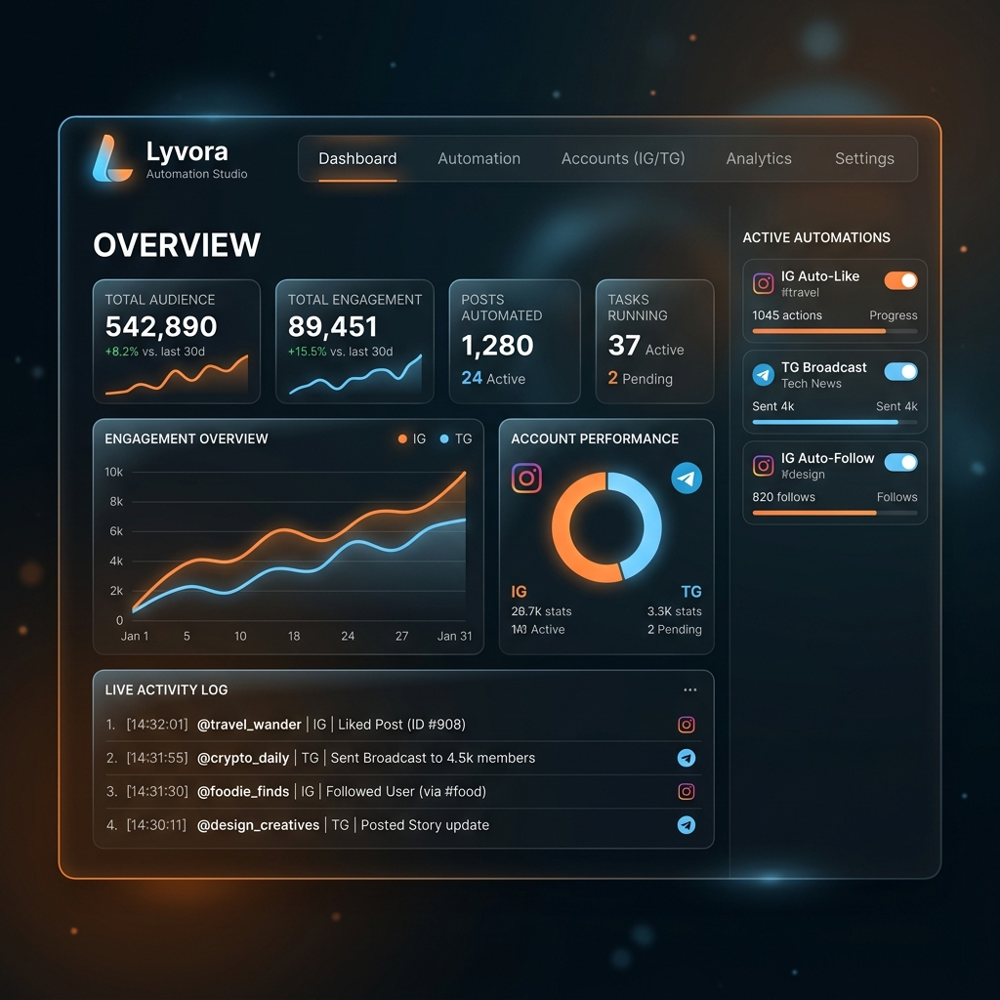

<p align="center">
  
</p>

<p align="center">
  
  
</p>

<h1 align="center">DBMS Database Design & Full-Stack Automation Repository</h1>

<p align="center">
  <strong>Comprehensive Repository for Database Systems, Practical Labs, and Full-Stack Creator Automation Platform</strong><br />
  <em>Organized into Skill, Practical, and Full Production Project Modules.</em>
</p>

<p align="center">
  
  
  
  
  
  
</p>

<p align="center">
  <a href="https://github.com/NLR-2007/2520030366_DBMS-DD">GitHub Repository</a> &middot;
  <a href="https://lyvoranlr.vercel.app">Live Project Dashboard</a> &middot;
  <a href="https://nlrgroupofcompany.in">NLR Group of Companies</a>
</p>

---

## 📌 Repository Overview

This repository is structured into **three primary modules** covering core DBMS skills, hands-on practical lab exercises, and a complete production-grade full-stack project (**Lyvora Creator Automation Platform**).

```
2520030366_DBMS-DD/
├── 🎓 skill/        # Core DBMS concepts, ER modeling, normalization & SQL mastery
├── 🧪 practical/    # Lab exercises, SQL scripts, procedure/trigger implementations
└── 🚀 project/      # Lyvora: Full-Stack Instagram & Telegram Automation Platform
```

---

## 📁 Repository Modules

### 1. 🎓 [Skill Module](skill/README.md)
Focuses on fundamental database concepts, theoretical paradigms, and core competencies:
- **ER & EER Diagramming**: Entity modeling, cardinalities, weak entities.
- **Relational Algebra & Calculus**: Formal foundations of relational operations.
- **Database Normalization**: 1NF through 5NF and Boyce-Codd Normal Form (BCNF).
- **Transaction Management**: ACID properties, concurrency control, MVCC, and locking protocols.

👉 Learn more in the [Skill Module README](skill/README.md).

---

### 2. 🧪 [Practical Module](practical/README.md)
Contains hands-on lab experiments, practical SQL scripts, and performance profiling:
- **DDL & DML Scripts**: Schema creation, integrity constraints, foreign keys.
- **Complex Queries**: Advanced joins, subqueries, CTEs, and window functions.
- **Stored Procedures & Triggers**: Event-driven automation within the database engine.
- **Performance & Indexing**: Query execution plan profiling (`EXPLAIN ANALYZE`).

👉 Explore the exercises in the [Practical Module README](practical/README.md).

---

### 3. 🚀 [Project Module: Lyvora Automation Platform](project/README.md)
A production-ready full-stack SaaS platform combining **Instagram DM automation** and **Telegram channel management** into a unified dashboard:

- **Backend**: FastAPI (Python 3.10+) with SQLAlchemy ORM, Pydantic validation, JWT authentication, and Playwright headless browser engine.
- **Frontend**: React 19 + Vite SPA with dynamic dashboard analytics, real-time log streaming, multi-account management, and responsive UI.
- **Database Schema**: 20 tables covering authentication, Instagram comment-to-DM triggers, Telegram bot scheduling, auto-moderation, and multi-tenant SaaS workspaces.

```
                    +------------------+
                    |  React Frontend  |
                    |  (Vite + React)  |
                    +--------+---------+
                             |
                        REST API calls
                             |
                    +--------v---------+
                    |  FastAPI Backend  |
                    |  (Python 3.10+)  |
                    +--------+---------+
                             |
               +-------------+-------------+
               |                           |
      +--------v--------+        +--------v--------+
      | Playwright       |        | Telegram Bot    |
      | Browser Engine   |        | API Client      |
      +--------+---------+        +--------+--------+
               |                           |
      +--------v--------+        +--------v--------+
      |  Instagram Web  |        |   Telegram API  |
      +------------------+        +-----------------+
               |                           |
               +-------------+-------------+
                             |
                    +--------v---------+
                    | SQLite / MySQL   |
                    | Database         |
                    +------------------+
```

👉 Read full setup, API docs, and architecture in the [Project Module README](project/README.md).

---

## ⚡ Quick Start (Project Module)

To run the main application inside `project/`:

```bash
# 1. Navigate to project directory
cd project

# 2. Run Backend API Server
powershell .\run_backend.bat
# Or manually:
python -m venv venv
venv\Scripts\activate
pip install -r backend/requirements.txt
python -m uvicorn backend.main:app --reload --port 8000

# 3. Run Frontend Dev Server (in new terminal)
powershell .\run_frontend.bat
# Or manually:
cd frontend
npm install
npm run dev
```

Access the frontend dashboard at `http://localhost:5173` and API docs at `http://localhost:8000/docs`.

---

## 📄 License & Attribution

Developed & Maintained by **NLR Group of Companies**.
Licensed under the [MIT License](project/COMPLIANCE.md).
